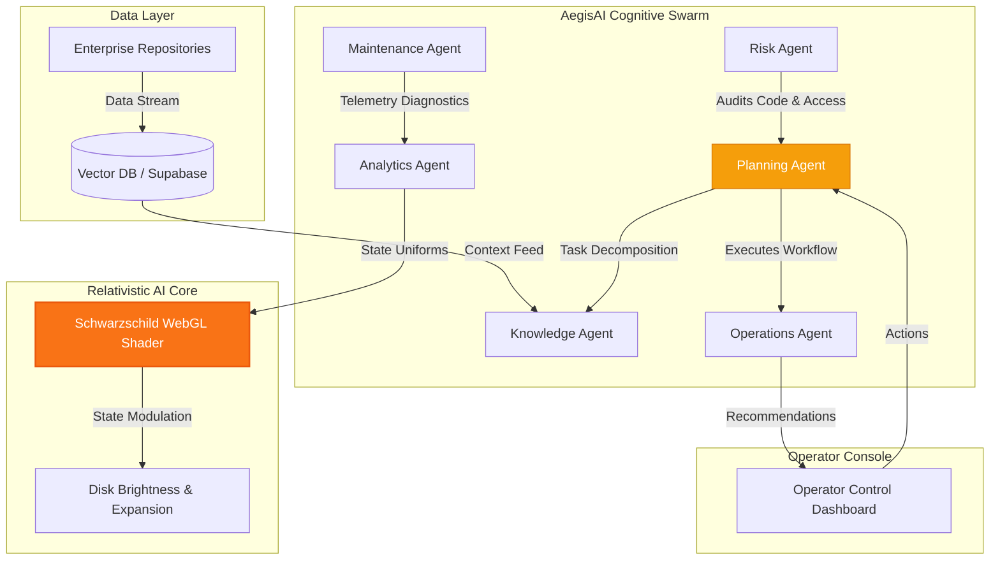

# 🌀 AegisAI — Enterprise Multi-Agent Generative AI Copilot

<p align="center">
  
  
  
</p>

---

AegisAI is a premium, real-time enterprise AI copilot. Built around the **Schwarzschild AI Core**—a real-time WebGL/GLSL geodesic raytracer—the platform coordinates six specialized autonomous subagents to automate context retrievals, telemetry diagnostics, and workflow executions. 

The user interface matches the physics of the black hole, blending slate-silver typography, deep dark-matter backgrounds (`#070913`), and high-contrast gold, orange, and amber accents reflecting the relativistic accretion disk glow.

---

## 🗺️ System Architecture

The following diagram illustrates the flow of control and telemetry from enterprise data sources to the operator console, processed through the multi-agent orchestration ring:



---

## 🧠 Cognitive Swarm (The 6 Autonomous Agents)

AegisAI coordinates six parallel subagents orbiting the AI Core:

*   **🧠 Planning Agent:** Decomposes complex user commands, orchestrates query executions, and manages task handoffs.
*   **📂 Knowledge Agent:** Interfaces with vector databases and file repositories, managing semantic context extraction.
*   **⚙️ Operations Agent:** Automates system actions, database mutations, and external API calls.
*   **🔧 Maintenance Agent:** Monitors live environment telemetry and schedules self-healing tasks.
*   **📈 Analytics Agent:** Computes KPI counters and structures diagnostic dashboards.
*   **🛡️ Risk Agent:** Validates access tokens and policies, auditing every instruction.

---

## 🛠️ Technology Stack

*   **Render Engine:** Three.js, WebGL, custom GLSL geodesic shaders.
*   **Animation & Motion:** GSAP (GreenSock) & GSAP ScrollTrigger for 60 FPS page transitions.
*   **Smooth Scrolling:** Lenis Scroll for momentum physics.
*   **Fonts & Typography:** Google Fonts Inter (weights 400 to 800) for slate-silver high-contrast layout.
*   **Backend Foundations:** FastAPI, Python, LangGraph orchestrations.

---

## 🚀 Quickstart Development

1.  **Initialize local HTTP server:**
    Ensure you run the development server from the `gargantua` subdirectory:
    ```bash
    cd gargantua
    python3 -m http.server 8123
    ```
2.  **View locally:**
    Open your browser and navigate to:
    ```
    http://localhost:8123
    ```
3.  **Explore Diagnostics:**
    Scroll to the footer and click `⚙ SHOW DIAGNOSTICS` to open the telemetry controls panel (mission clock, disk inclination, and render profiles).

---

## 🛰️ Schwarzschild Telemetry Coordinates

When the diagnostics panel is active, you can monitor the relativistic parameters of the AI Core:
- **Observer Distance:** Radius coordinate from the gravity center.
- **Disk Inclination:** Angle of the accretion disk relative to the viewport observer.
- **Geodesic Steps:** Number of raymarching steps computed in the fragment shader.

---

<p align="center">
  AegisAI © 2026. Relativistic Core licensed under Schwarzschild Metric.
</p>
