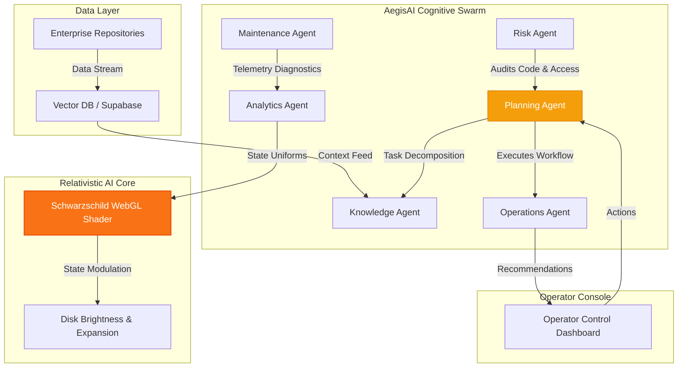

# 🌀 AegisAI — Enterprise Multi-Agent Generative AI Copilot

<p align="center">
  
  
  
</p>

---

AegisAI is a premium, real-time enterprise AI copilot. Built around the **Schwarzschild AI Core**—a real-time WebGL/GLSL geodesic raytracer—the platform coordinates six specialized autonomous subagents to automate context retrievals, telemetry diagnostics, and workflow executions. 

The user interface matches the physics of the black hole, blending slate-silver typography, deep dark-matter backgrounds (`#070913`), and high-contrast gold, orange, and amber accents reflecting the relativistic accretion disk glow.

---

## 🗺️ System Architecture

The following diagram illustrates the flow of control and telemetry from enterprise data sources to the operator console, processed through the multi-agent orchestration ring:



---

## 🧠 Cognitive Swarm (The 6 Autonomous Agents)

AegisAI coordinates six parallel subagents orbiting the AI Core:

*   **🧠 Planning Agent:** Decomposes complex user commands, orchestrates query executions, and manages task handoffs.
*   **📂 Knowledge Agent:** Interfaces with vector databases and file repositories, managing semantic context extraction.
*   **⚙️ Operations Agent:** Automates system actions, database mutations, and external API calls.
*   **🔧 Maintenance Agent:** Monitors live environment telemetry and schedules self-healing tasks.
*   **📈 Analytics Agent:** Computes KPI counters and structures diagnostic dashboards.
*   **🛡️ Risk Agent:** Validates access tokens and policies, auditing every instruction.

---

## 🛠️ Technology Stack

*   **Render Engine:** Three.js, WebGL, custom GLSL geodesic shaders.
*   **Animation & Motion:** GSAP (GreenSock) & GSAP ScrollTrigger for 60 FPS page transitions.
*   **Smooth Scrolling:** Lenis Scroll for momentum physics.
*   **Fonts & Typography:** Google Fonts Inter (weights 400 to 800) for slate-silver high-contrast layout.
*   **Backend Foundations:** FastAPI, Python, LangGraph orchestrations.

---

## 🚀 Local Development & Hosting Guide

### Local Development Servers

#### 1. Python HTTP Server (Built-in)
Run the development server from the `gargantua/` directory:
```bash
cd gargantua
python3 -m http.server 8123
```
Open `http://localhost:8123` in your browser.

#### 2. VS Code Live Server (IDE Extension)
- Open the project workspace folder in VS Code.
- Right-click `gargantua/index.html` and select **Open with Live Server**.
- It will boot automatically on port `5500`.

---

### Production Web Servers

#### 3. Nginx Configuration
Add the following server block configuration in `/etc/nginx/sites-available/aegisai`:
```nginx
server {
    listen 80;
    server_name aegisai.local;

    root /var/www/aegisai/gargantua;
    index index.html;

    location / {
        try_files $uri $uri/ =404;
    }

    # Cache static assets aggressively
    location ~* \.(js|css|png|jpg|jpeg|gif|ico|svg|mp3|opus)$ {
        expires 30d;
        add_header Cache-Control "public, no-transform";
    }
}
```

#### 4. Apache Configuration
Create a `.htaccess` file inside the `gargantua/` folder:
```apache
DirectoryIndex index.html

# Enable rewrite engine if doing custom routing
RewriteEngine On
RewriteCond %{REQUEST_FILENAME} !-f
RewriteCond %{REQUEST_FILENAME} !-d
RewriteRule ^ index.html [L]
```

---

### Cloud Platforms Deployment

#### 5. Vercel Configuration (Automatic)
The project includes a root [vercel.json](file:///Users/srujanmirji/Documents/GARGANTUA/vercel.json) file:
```json
{
  "cleanUrls": true,
  "trailingSlash": false,
  "rewrites": [
    { "source": "/(.*)", "destination": "/gargantua/$1" }
  ]
}
```
Simply connect your GitHub repository to Vercel and click **Deploy**. Vercel will rewrite all root traffic directly into `/gargantua` under the hood.

#### 6. Netlify Configuration (Automatic)
The project includes a root [netlify.toml](file:///Users/srujanmirji/Documents/GARGANTUA/netlify.toml) file:
```toml
[build]
  base = "gargantua"
  publish = "gargantua"
```
Connect your GitHub repository to Netlify; it will read this config and build the subfolder automatically.

#### 7. GitHub Pages Configuration
Deploy the contents of the `gargantua/` subdirectory to a separate `gh-pages` branch using the subtree push command in your terminal:
```bash
git subtree push --prefix gargantua origin gh-pages
```
Go to repository settings -> **Pages** -> Set branch to **`gh-pages`** to publish the site.

---

## 🛰️ Schwarzschild Telemetry Coordinates

When the diagnostics panel is active, you can monitor the relativistic parameters of the AI Core:
- **Observer Distance:** Radius coordinate from the gravity center.
- **Disk Inclination:** Angle of the accretion disk relative to the viewport observer.
- **Geodesic Steps:** Number of raymarching steps computed in the fragment shader.

---

<p align="center">
  AegisAI © 2026. Relativistic Core licensed under Schwarzschild Metric.
</p>
